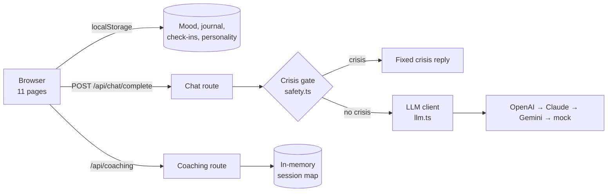

# Youna — System architecture

> Status: AUTHORED · Updated 2026-09-23 · Owner: Ossama Mokhtar

**One Next.js 15 app. The browser holds all user data; the server holds no user state except in-memory coaching sessions.** The server exists to keep API keys off the client and to run the second safety gate.

## Components

| Component | File | Role |
|---|---|---|
| Pages | `src/app/*/page.tsx` | `/`, `/chat`, `/voice`, `/checkin`, `/mood`, `/journal`, `/insights`, `/coaching`, `/assessment`, `/features`, `/about` |
| Safety module | `src/lib/safety.ts` | Crisis patterns, fixed reply, low-mood rule; used by client and server |
| LLM client | `src/lib/llm.ts` | Provider routing, per-provider keys, fallback, cost estimate per call |
| Prompts | `src/lib/prompts.ts` | System prompt per mode (default, counseling intent, crisis) with personality context |
| Coaching engine | `src/lib/coaching.ts`, `/api/coaching` | Scripted step-by-step programs; no model call |
| Insights | `src/lib/insights.ts` | Trends, streaks, keyword sentiment over local data |
| Voice | `src/components/VoiceChat.tsx` | Web Speech API in the browser; audio never leaves the device |
| Auth + DB (scaffold) | `src/lib/auth.ts`, `src/lib/db.ts`, `prisma/` | NextAuth + Prisma 7; not wired into flows |

## Request flow: a chat message

1. The client checks the text with `isCrisisText()`. On a match it shows the fixed reply and the resources panel, and never calls the server.
2. Otherwise it posts to `/api/chat/complete`. The server rate-limits (20/min per client), then runs the same crisis check.
3. With no crisis, the server builds the system prompt and calls the configured provider. If that fails it tries the fallbacks, and if all fail it returns the mock reply.
4. `YOUNA_MOCK_MODE` defaults to mock, so a fresh deployment never spends tokens by accident.

## Scale envelope

Single-user, single-device by design today. localStorage means no sync and no backup. Coaching sessions live in a per-instance `Map`, so on serverless a session can be lost between requests (GAPS #3).
